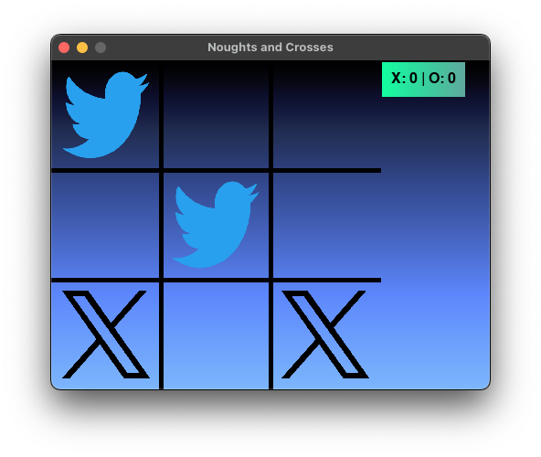
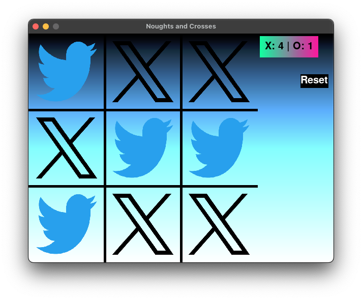
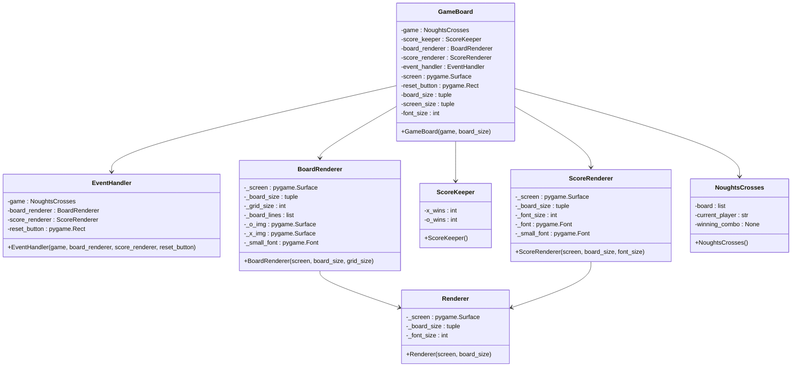
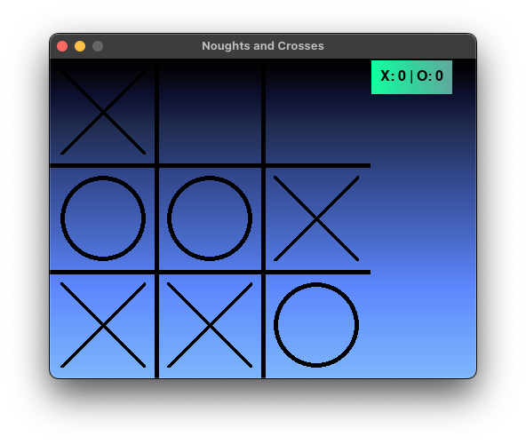
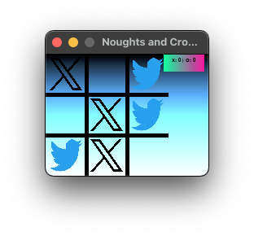
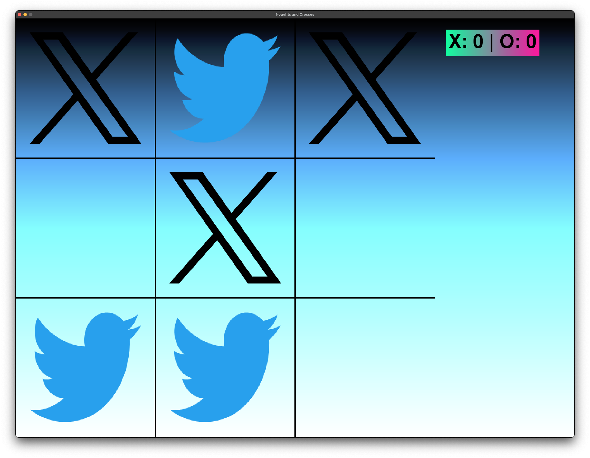

<p align="center">
    
</p>

<h1 align="center">Noughts and Crosses <br>(SWE Home Assignment)</h1>

This is a simple implementation of the game Noughts and Crosses (Tic Tac Toe) in Python. The game is played on a 3x3 grid and the first player to get 3 of their marks in a row (horizontally, vertically or diagonally) wins the game.

The original code was compiled to webassembly using [Pyodide](https://pyodide.org/en/stable/), a Python environment for the browser. An online demo of the game can be found [here](https://dorpascal.com/noughts-crosses/).

- [Requirements](#requirements)
  - [Installation](#installation)
- [How to play](#how-to-play)
- [Code Overview](#code-overview)
  - [Error Handling](#error-handling)
  - [Testing](#testing)
  - [Edge Cases](#edge-cases)

---

## Requirements

- Python 3.x
- Pygame

### Installation

To install Pygame, run the following command:

Set virtual environment (recommended):

```bash
python3 -m venv .venv
source .venv/bin/activate
```

Install requirements:

```bash
pip install -r requirements.txt
```

Run the game:

```bash
python3 src/main.py
```

## How to play

The game is designed for 2 players. Player 1 is 'X' and Player 2 is 'O'. Players take turns to place their mark on the grid by clicking on an empty cell. The game ends when one of the players gets 3 of their marks in a row or when there are no more empty cells left on the grid.

The gameplay is straightforward, as can be seen in the GIF below. The scoreboard keeps track of the number of wins for each player. The game can be reset at any time by clicking the "Reset" button.

<p align="center">
    
</p>

<p align="center">
    
</p>
Note that the reset button is hidden and apears during a tie, but can also be clicked during game.

## Code Overview

The game consists of the following classes (if you are unable to view the diagram, please refer to the [class_diagram.png](images/class_diagram.png) file):



- `EventHandler`: This class is responsible for handling user interactions with the game. It takes in user inputs and triggers the appropriate responses in the game.

- `GameBoard`: This class represents the game board. It keeps track of the game state, including the current player, the game board's size, and the game's visual elements. It also holds instances of `NoughtsCrosses`, `ScoreKeeper`, `BoardRenderer`, `ScoreRenderer`, and `EventHandler`.

- `Renderer`: This is a base class for rendering elements on the screen. It holds common attributes and methods that are used by its subclasses.

- `BoardRenderer`: This class is a subclass of `Renderer`. It is responsible for rendering the game board on the screen.

- `ScoreKeeper`: This class keeps track of the scores of the players. It increments the score of the current player when they win a game.

- `ScoreRenderer`: This class is a subclass of `Renderer`. It is responsible for rendering the scores on the screen.

- `NoughtsCrosses`: This class contains the logic of the Noughts and Crosses game. It keeps track of the current state of the game board, the current player, and the winning combination if there is one.

### Error Handling

The program utilize Python `try` and `except` blocks to catch exceptions and handle errors. For example, the `run` function in the `GameBoard` class catches exceptions that occur during the game loop and prints an error message to the console. Inplace error handling was also included, such as raising `ValueError` when the game logic encounters an invalid move in the `make_move` method of the `NoughtsCrosses` class.

Where program flow could continued, a fallback procedure was implemented. For example, when the images for the 'X' and 'O' marks could not be loaded, the program would fallback to generate the figures using Pygame's drawing functions.

<p align="center">
    
</p>

### Testing

The `tester.py` module contains unit tests for the classes in the `renderer.py`, `gameboard.py`, and `event_handler.py` files. These tests are designed to ensure that the game's components are functioning as expected.

The tests are organized into several classes, each of which corresponds to a class in the game's code. Each class contains a `setUp` method, which initializes the game, board size, and other necessary components for the tests.

To run the tests, execute the `tester.py` file. If all tests pass, the components of the game are working as expected. If any test fails, it indicates a problem with the corresponding component of the game.

### Edge Cases

The game was tested with various edge cases to ensure that it behaves correctly in all scenarios. Some of the edge cases tested include:

- **Maximum score limit**: The game was tested to ensure that the score limit is correctly enforced, and the game ends when one player reaches the maximum score.
- **Invalid moves**: The game was tested to ensure that players cannot make invalid moves, such as placing a mark on an already occupied cell or making a move after the game has ended.
- **Window resizing**: The game was tested to ensure that it behaves correctly when the window is resized. The game board and scores should adjust to fit the new window size. User can control the board size in the `config.py` file.

<p align="center">
    
    <br>
    
</p>
